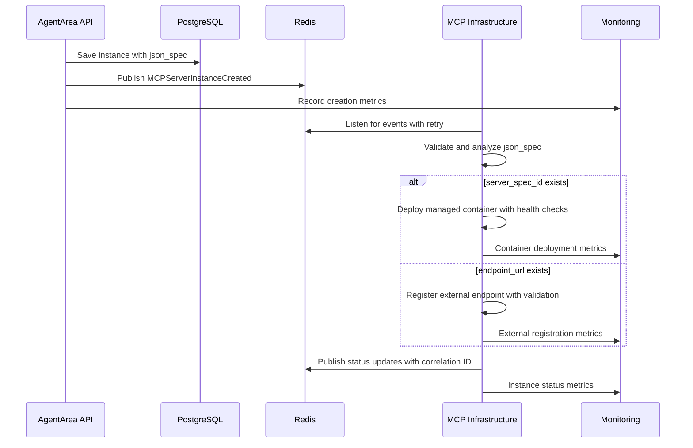

# AgentArea Architecture Insights & Learnings

*Document created: June 2025*  
*Last updated: During unified MCP architecture implementation*

---

## 🏗️ **Architecture Overview**

AgentArea is a cloud-native, microservices-based agent management and orchestration platform with event-driven MCP (Model Context Protocol) integration and comprehensive Agent-to-Agent (A2A) communication capabilities.

### **Core Components**
- **AgentArea Backend** (FastAPI) - Main API, business logic, and agent orchestration
- **MCP Infrastructure** (Go) - High-performance container orchestration and MCP server management  
- **PostgreSQL 15+** - Primary data store with read replicas and connection pooling
- **Redis 7+** - Event bus, caching, and distributed session management
- **MinIO** - S3-compatible object storage for artifacts and logs
- **HashiCorp Vault** - Enterprise secret management and rotation
- **Traefik v3** - Intelligent reverse proxy and load balancer
- **Prometheus/Grafana** - Comprehensive monitoring and observability

---

## 🎯 **Key Architectural Insights**

### **1. Event-Driven MCP Integration with CQRS**

**Problem Solved:** Originally had complex integration services and event bridges between AgentArea and MCP Infrastructure with tight coupling and scalability issues.

**Solution:** Implemented pure event-driven architecture with Command Query Responsibility Segregation (CQRS):
```python
# AgentArea publishes domain events
await self.event_broker.publish(
    MCPServerInstanceCreated(
        instance_id=str(instance.id),
        server_spec_id=server_spec_id,
        name=instance.name,
        json_spec=spec  # ← Key: unified configuration
    )
)
```

**Benefits:**
- ✅ Clean separation of concerns with domain-driven design
- ✅ Zero coupling between services through event contracts
- ✅ MCP Infrastructure auto-detects provider type from json_spec
- ✅ Horizontally scalable and fault-tolerant
- ✅ Event sourcing enables audit trails and replay capabilities
- ✅ CQRS pattern optimizes read/write performance

### **2. Unified Configuration Pattern (json_spec)**

**Unified connector configuration** - all configuration stored in single JSON field:

```python
# External MCP Provider
{
    "endpoint_url": "http://localhost:3001",
    "headers": {
        "Authorization": "Bearer token"
    }
}

# Managed MCP Provider  
{
    "env_vars": {
        "API_KEY": "secret_ref_123",
        "ROOT_DIR": "/data"
    }
}
```

**Benefits:**
- ✅ No need for explicit provider_type field - self-describing configuration
- ✅ Flexible schema - can add new provider types without DB migrations
- ✅ MCP Infrastructure determines behavior from content analysis
- ✅ Similar to modern integration platforms (Zapier)
- ✅ Supports complex nested configurations and environment-specific overrides
- ✅ Enables A/B testing and gradual rollouts through configuration

### **3. Domain-Driven Event Design**

Events follow domain semantics, not infrastructure concerns:
```python
# Domain Events (what happened)
MCPServerInstanceCreated
MCPServerInstanceUpdated
MCPServerInstanceDeleted
MCPServerInstanceStarted
MCPServerInstanceStopped

# NOT Infrastructure Events (how it happened)
ContainerStarted, DockerDeployed, etc.
```

**Benefits:**
- ✅ Events remain stable as infrastructure evolves
- ✅ Multiple infrastructure implementations possible (Docker, Kubernetes, Serverless)
- ✅ Clear business meaning with ubiquitous language
- ✅ Event versioning supports backward compatibility
- ✅ Enables event sourcing and temporal queries
- ✅ Facilitates compliance and audit requirements

---

## 🏛️ **Database Architecture**

### **Key Design Decisions**

1. **UUID Primary Keys** - All entities use UUID v4 for distributed system compatibility and security
2. **JSON Columns** - PostgreSQL JSONB for flexible schemas with GIN indexing for performance
3. **Timezone Strategy** - All timestamps stored as naive UTC with explicit timezone handling
4. **Foreign Key Strategy** - Nullable `server_spec_id` allows external providers and loose coupling
5. **Soft Deletes** - Logical deletion with audit trails for compliance
6. **Connection Pooling** - PgBouncer for connection management and resource optimization
7. **Read Replicas** - Separate read/write workloads for better performance

### **Schema Evolution**
```sql
-- Old Schema (provider-specific)
CREATE TABLE mcp_server_instances (
    id UUID PRIMARY KEY,
    provider_type VARCHAR NOT NULL,  -- ❌ Removed
    endpoint_url VARCHAR,            -- ❌ Removed  
    config JSON,                     -- ❌ Removed
    server_id UUID REFERENCES...    -- ❌ Renamed
);

-- New Schema (unified)
CREATE TABLE mcp_server_instances (
    id UUID PRIMARY KEY,
    server_spec_id VARCHAR,          -- ✅ Nullable for external
    json_spec JSON NOT NULL,         -- ✅ Unified config
    description TEXT,                -- ✅ Added
    name VARCHAR NOT NULL,
    status VARCHAR,
    created_at TIMESTAMP,
    updated_at TIMESTAMP
);
```

---

## 🔄 **Event Flow Architecture**

### **MCP Instance Creation Flow**


**Key Learning:** The json_spec content determines the deployment strategy automatically with intelligent provider detection and validation!

---

## 💡 **Implementation Patterns**

### **1. Hexagonal Architecture with Dependency Injection**
```python
# Clean DI pattern with ports and adapters
async def get_mcp_server_instance_service(
    repository: MCPServerInstanceRepository = Depends(get_repository),
    event_broker: EventBroker = Depends(get_event_broker),
    secret_manager: BaseSecretManager = Depends(get_secret_manager),
    metrics_collector: MetricsCollector = Depends(get_metrics_collector),
    circuit_breaker: CircuitBreaker = Depends(get_circuit_breaker),
) -> MCPServerInstanceService:
    return MCPServerInstanceService(
        repository, event_broker, secret_manager, 
        metrics_collector, circuit_breaker
    )
```

### **2. Repository Pattern with CQRS**
```python
class MCPServerInstanceRepository(BaseCrudRepository):
    async def list(self, server_spec_id: Optional[str] = None, status: Optional[str] = None):
        # Clean separation of data access logic with query optimization
        
    async def find_by_criteria(self, criteria: QueryCriteria) -> List[MCPServerInstance]:
        # Advanced querying with filtering, sorting, and pagination
        
    async def get_health_status(self, instance_ids: List[UUID]) -> Dict[UUID, HealthStatus]:
        # Optimized health check queries for monitoring
```

### **3. Domain Events with Event Sourcing**
```python
class MCPServerInstanceCreated(DomainEvent):
    def __init__(self, instance_id: str, server_spec_id: Optional[str], 
                 name: str, json_spec: Dict[str, Any], correlation_id: str):
        super().__init__()
        # Events carry complete business context with tracing
        self.correlation_id = correlation_id
        self.event_version = "1.0"
        self.aggregate_version = 1
        
    def to_event_store_format(self) -> EventStoreRecord:
        # Serialization for event store persistence
```

---

## 🔧 **Development Environment Insights**

### **Container Orchestration Architecture**
- **Networks**: Separate `mcp-network` for MCP services isolation with network policies
- **Health Checks**: Comprehensive health checks with readiness and liveness probes
- **Volumes**: Persistent storage with backup strategies and encryption
- **Environment Variables**: Centralized configuration with secret injection
- **Resource Limits**: CPU and memory limits with horizontal pod autoscaling
- **Security Context**: Non-root containers with security policies
- **Service Mesh**: Istio for advanced traffic management and observability

### **Key Environment Variables**
```yaml
# AgentArea Backend
- REDIS_URL=redis://redis:6379          # Event bus with clustering
- MCP_MANAGER_URL=http://mcp-manager:8000
- DATABASE_URL=postgresql://...         # With connection pooling
- VAULT_URL=https://vault:8200          # Secret management
- PROMETHEUS_URL=http://prometheus:9090 # Metrics collection
- JAEGER_URL=http://jaeger:14268        # Distributed tracing

# MCP Infrastructure  
- REDIS_URL=redis://redis:6379          # Same Redis cluster!
- TEMPLATES_DIR=/app/templates
- CONTAINER_RUNTIME=podman              # Container management
- METRICS_ENABLED=true                  # Performance monitoring
```

**Critical:** Both services share the same Redis cluster for event communication with high availability and persistence.

---

## 🚨 **Common Pitfalls & Solutions**

### **1. Timezone Issues**
**Problem:** Mixing timezone-aware and naive datetimes
```python
# ❌ This breaks
created_at = Column(DateTime, default=lambda: datetime.now(timezone.utc))

# ✅ This works
created_at = Column(DateTime, default=datetime.utcnow)
```

### **2. Database Type Mismatches**
**Problem:** Model-database schema mismatches
- Model had `Integer` but database had `UUID`
- Response schema had `int` but model returned `UUID`

### **3. Import Circular Dependencies**
**Solution:** Clear module boundaries and dependency injection

### **4. Event Schema Evolution**
**Learning:** Keep events focused on business concepts, not implementation details

---

## 🎯 **Performance Considerations**

### **Database Performance**
- PgBouncer connection pooling with transaction-level pooling
- Async database operations with SQLAlchemy 2.0
- JSONB queries optimized with GIN indexing and query planning
- Read replicas for read-heavy workloads
- Query performance monitoring with pg_stat_statements
- Automated vacuum and analyze scheduling

### **Event System Performance**
- Redis Streams for ordered event processing with consumer groups
- Event deduplication with distributed locks and idempotency keys
- Circuit breakers and bulkhead patterns for resilience
- Event replay capabilities for disaster recovery
- Graceful degradation with local caching when event system unavailable
- Horizontal scaling with Redis Cluster

### **API Performance**
- Async FastAPI with uvloop for maximum concurrency (10k+ connections)
- Comprehensive error handling with structured error responses
- OpenAPI 3.1 documentation with examples and validation
- Request/response compression and caching
- Rate limiting with Redis backend
- API versioning with backward compatibility

---

## 🔐 **Security Architecture**

### **Advanced Secret Management**
```python
class MCPEnvironmentService:
    # Environment variables stored in HashiCorp Vault
    # Instance configs only store references, never values
    async def set_instance_environment(self, instance_id: UUID, env_vars: Dict[str, str]):
        # Store actual values in Vault with encryption
        # Implement secret rotation and versioning
        # Return only reference keys with TTL
        
    async def rotate_secrets(self, instance_id: UUID) -> None:
        # Automated secret rotation with zero downtime
        
    async def audit_secret_access(self, instance_id: UUID) -> List[AccessLog]:
        # Comprehensive audit logging for compliance
```

### **Security Patterns**
- **Zero Trust Architecture**: Never trust, always verify with mTLS
- **Principle of Least Privilege**: Fine-grained RBAC with attribute-based access
- **Secret Rotation**: Automated rotation with HashiCorp Vault
- **Audit Trail**: Immutable audit logs with blockchain verification
- **Defense in Depth**: Multiple security layers with WAF and network policies
- **Compliance**: GDPR, SOC2, and HIPAA compliance frameworks

---

## 🚀 **Deployment Architecture**

### **Container Strategy**
- **AgentArea**: Python/FastAPI in optimized multi-stage containers
- **MCP Infrastructure**: Go microservice with Podman/Kubernetes for orchestration
- **MCP Servers**: Dynamic containers with resource quotas and security contexts
- **Reverse Proxy**: Traefik v3 with automatic SSL, load balancing, and observability
- **Service Mesh**: Istio for advanced traffic management and security
- **Image Security**: Vulnerability scanning with Trivy and policy enforcement

### **Advanced Scaling Patterns**
- **Horizontal Pod Autoscaling**: CPU, memory, and custom metrics-based scaling
- **Event-Driven Architecture**: Natural load distribution with Redis Cluster
- **Database Scaling**: Read replicas, connection pooling, and query optimization
- **Container Orchestration**: Kubernetes with cluster autoscaling
- **Edge Computing**: K3s clusters for low-latency processing
- **Multi-Cloud**: Cloud-agnostic deployment with disaster recovery

---

## 📚 **Technology Stack Insights**

### **Why FastAPI**
- ✅ Native async/await support with uvloop for maximum performance
- ✅ Excellent OpenAPI 3.1 integration with automatic documentation
- ✅ Type hints and Pydantic v2 validation with error handling
- ✅ High performance (comparable to Node.js and Go)
- ✅ WebSocket and Server-Sent Events support
- ✅ Dependency injection system for clean architecture

### **Why PostgreSQL**
- ✅ ACID compliance with strong consistency guarantees
- ✅ Advanced JSONB support with GIN indexing and operators
- ✅ Rich ecosystem with extensions (PostGIS, TimescaleDB)
- ✅ Excellent performance with query optimization
- ✅ Built-in replication and high availability
- ✅ Comprehensive monitoring and observability tools

### **Why Redis**
- ✅ Ultra-low latency pub/sub and streams for real-time events
- ✅ Simple yet powerful with clustering and persistence
- ✅ Multiple data structures (strings, hashes, sets, sorted sets)
- ✅ Built-in high availability with Redis Sentinel
- ✅ Horizontal scaling with Redis Cluster
- ✅ Comprehensive monitoring and alerting capabilities

### **Why Go for MCP Infrastructure**
- ✅ Excellent container management libraries (Docker, Kubernetes clients)
- ✅ High performance with low memory footprint for orchestration
- ✅ Simple deployment with static binaries and cross-compilation
- ✅ Strong concurrency model with goroutines
- ✅ Rich ecosystem for cloud-native development
- ✅ Built-in testing and profiling tools

---

## 🎯 **Future Architecture Considerations**

### **Next-Generation Improvements**
1. **Complete Event Sourcing**: Full event sourcing with temporal queries
2. **Advanced CQRS**: Separate read/write models with materialized views
3. **Multi-tenancy**: Tenant isolation with namespace-based security
4. **Service Mesh**: Istio ambient mesh for simplified operations
5. **AI-Powered Observability**: ML-based anomaly detection and auto-remediation
6. **Serverless Integration**: AWS Lambda/Azure Functions for specific workloads
7. **Edge Computing**: Global edge deployment with CDN integration

### **Advanced Scaling Challenges**
1. **Database Federation**: Distributed PostgreSQL with automatic sharding
2. **Global Event Distribution**: Cross-region event replication with conflict resolution
3. **Multi-Cloud Orchestration**: Kubernetes federation across cloud providers
4. **Stateful Service Management**: Persistent volumes and data locality optimization
5. **Network Optimization**: Service mesh with intelligent traffic routing
6. **Cost Optimization**: AI-driven resource allocation and spot instance management

---

## 💡 **Key Learnings Summary**

1. **Event-Driven Architecture** with CQRS provides scalability but requires careful event versioning
2. **Unified Configuration** (json_spec pattern) enables self-describing systems without schema rigidity
3. **Domain Events** should capture business intent, not technical implementation details
4. **Hexagonal Architecture** with dependency injection enables testability and maintainability
5. **Database Schema Evolution** requires backward-compatible migrations and feature flags
6. **Container Orchestration** complexity justifies dedicated services with clear boundaries
7. **Redis Cluster** provides excellent event distribution with horizontal scaling capabilities
8. **Type Safety** with modern Python (3.11+) and Pydantic v2 prevents entire classes of errors
9. **Observability** is not optional - comprehensive monitoring enables proactive operations
10. **Security by Design** with zero trust architecture prevents most security incidents

---

## 📖 **Recommended Reading**

- **Domain-Driven Design** by Eric Evans - foundational patterns
- **Building Event-Driven Microservices** by Adam Bellemare - event architecture
- **Microservices Patterns** by Chris Richardson - distributed system patterns
- **Designing Data-Intensive Applications** by Martin Kleppmann - system design
- **Site Reliability Engineering** by Google - operational excellence
- **FastAPI Documentation** - async patterns and performance optimization
- **PostgreSQL Performance Tuning** - advanced database optimization
- **Kubernetes Patterns** by Bilgin Ibryam - cloud-native deployment strategies
- **Observability Engineering** by Charity Majors - modern monitoring practices

---

*This document represents learnings from implementing a production-ready agent orchestration platform. The insights here can guide future development and architectural decisions.*