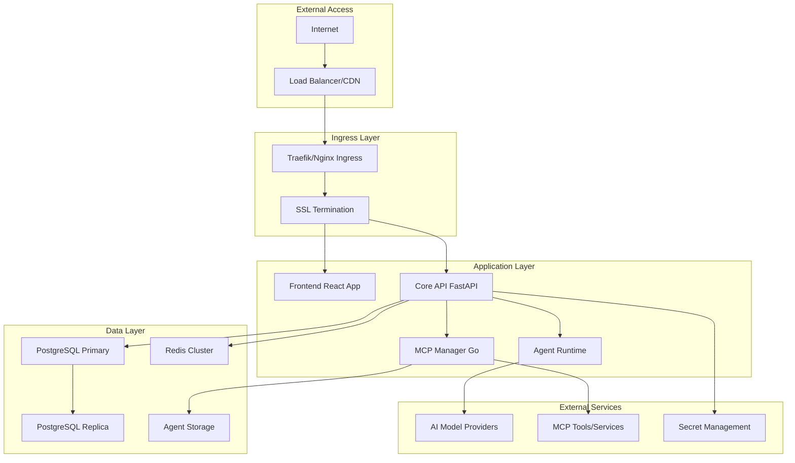

# Infrastructure Overview

<Info>
This guide provides a comprehensive overview of AgentArea's infrastructure architecture, deployment patterns, and best practices for running a scalable AI agents platform.
</Info>

## 🏗️ Architecture Overview

AgentArea follows a microservices architecture designed for scalability, reliability, and maintainability:



## 🎯 Deployment Patterns

### Development Environment

<Tabs>
  <Tab title="Docker Compose">
    **Single-machine development setup**
    
    ```yaml
    # docker-compose.dev.yml
    version: '3.8'
    
    services:
      agentarea-api:
        build: .
        ports:
          - "8000:8000"
        environment:
          - ENVIRONMENT=development
          - HOT_RELOAD=true
        volumes:
          - ./src:/app/src
          - ./tests:/app/tests
        depends_on:
          - postgres
          - redis
    
      agentarea-frontend:
        build: ./agentarea-webapp
        ports:
          - "3000:3000"
        environment:
          - NODE_ENV=development
        volumes:
          - ./agentarea-webapp/src:/app/src
    
      postgres:
        image: postgres:15-alpine
        environment:
          POSTGRES_DB: agentarea_dev
          POSTGRES_USER: dev
          POSTGRES_PASSWORD: dev
        volumes:
          - postgres_dev_data:/var/lib/postgresql/data
        ports:
          - "5432:5432"
    
      redis:
        image: redis:7-alpine
        ports:
          - "6379:6379"
        volumes:
          - redis_dev_data:/data
    
    volumes:
      postgres_dev_data:
      redis_dev_data:
    ```
  </Tab>
  
  <Tab title="Local Kubernetes">
    **Using minikube or kind for local testing**
    
    ```bash
    # Start local Kubernetes cluster
    minikube start --cpus=4 --memory=8192
    
    # Install AgentArea using Helm
    helm repo add agentarea https://charts.agentarea.ai
    helm install agentarea agentarea/agentarea \
      --set environment=development \
      --set api.replicas=1 \
      --set frontend.replicas=1 \
      --set postgresql.enabled=true \
      --set redis.enabled=true
    
    # Port forward for local access
    kubectl port-forward svc/agentarea-api 8000:8000
    kubectl port-forward svc/agentarea-frontend 3000:3000
    ```
  </Tab>
</Tabs>

### Staging Environment

<CardGroup cols={2}>
  <Card title="Single Node Staging" icon="server">
    - Single Kubernetes node or VM
    - Minimal resource allocation
    - Shared databases and services
    - Perfect for integration testing
  </Card>
  
  <Card title="Multi-Service Staging" icon="layers">
    - Multiple services and replicas
    - Dedicated databases
    - Load testing capabilities
    - Production-like configuration
  </Card>
</CardGroup>

### Production Environment

<Tabs>
  <Tab title="High Availability">
    ```yaml
    # Production HA configuration
    agentarea:
      api:
        replicas: 3
        resources:
          requests:
            cpu: "500m"
            memory: "1Gi"
          limits:
            cpu: "2"
            memory: "4Gi"
        
        autoscaling:
          enabled: true
          minReplicas: 3
          maxReplicas: 10
          targetCPU: 70
          targetMemory: 80
      
      frontend:
        replicas: 2
        resources:
          requests:
            cpu: "100m"
            memory: "256Mi"
          limits:
            cpu: "500m"
            memory: "512Mi"
      
      mcpManager:
        replicas: 2
        resources:
          requests:
            cpu: "250m"
            memory: "512Mi"
          limits:
            cpu: "1"
            memory: "2Gi"
    
    postgresql:
      architecture: replication
      primary:
        resources:
          requests:
            cpu: "1"
            memory: "2Gi"
          limits:
            cpu: "4"
            memory: "8Gi"
      
      readReplicas:
        replicaCount: 2
        resources:
          requests:
            cpu: "500m"
            memory: "1Gi"
    
    redis:
      architecture: replication
      master:
        resources:
          requests:
            cpu: "250m"
            memory: "512Mi"
      replica:
        replicaCount: 2
    ```
  </Tab>
  
  <Tab title="Multi-Region">
    ```yaml
    # Multi-region deployment
    regions:
      us-west-2:
        primary: true
        clusters:
          - production-west-1
        resources:
          api_replicas: 5
          frontend_replicas: 3
      
      us-east-1:
        primary: false
        clusters:
          - production-east-1
        resources:
          api_replicas: 3
          frontend_replicas: 2
      
      eu-west-1:
        primary: false
        clusters:
          - production-eu-1
        resources:
          api_replicas: 3
          frontend_replicas: 2
    
    database:
      primary_region: us-west-2
      read_replicas:
        - region: us-east-1
          lag_tolerance: 5s
        - region: eu-west-1
          lag_tolerance: 10s
    
    redis:
      global_replication: true
      sync_timeout: 1s
    ```
  </Tab>
</Tabs>

## 🔧 Component Architecture

### Core Services

<Accordion>
  <AccordionItem title="AgentArea API (FastAPI)">
    **Main application backend**
    
    ```yaml
    api:
      language: Python 3.11+
      framework: FastAPI
      features:
        - Async/await support
        - Automatic OpenAPI generation
        - Request validation with Pydantic
        - Background task processing
      
      dependencies:
        - SQLAlchemy 2.0 (Database ORM)
        - Alembic (Database migrations)
        - Redis (Caching and queues)
        - Celery (Background tasks)
      
      scaling:
        horizontal: true
        stateless: true
        session_affinity: false
      
      health_checks:
        - /health (basic health)
        - /health/db (database connectivity)
        - /health/redis (Redis connectivity)
        - /metrics (Prometheus metrics)
    ```
  </AccordionItem>
  
  <AccordionItem title="Frontend Application (React/Next.js)">
    **User interface and dashboard**
    
    ```yaml
    frontend:
      language: TypeScript
      framework: Next.js 14+
      features:
        - Server-side rendering
        - Static site generation
        - API routes
        - Real-time updates
      
      dependencies:
        - React 18+
        - Tailwind CSS
        - Shadcn/ui components
        - Zustand (State management)
      
      scaling:
        horizontal: true
        cdn_enabled: true
        static_assets: true
      
      build:
        output: static
        optimization: true
        bundle_analysis: true
    ```
  </AccordionItem>
  
  <AccordionItem title="MCP Manager (Go)">
    **Model Context Protocol service orchestration**
    
    ```yaml
    mcp_manager:
      language: Go 1.21+
      features:
        - Container orchestration
        - Dynamic service provisioning
        - Health monitoring
        - Resource management
      
      dependencies:
        - Docker/Podman client
        - Kubernetes client-go
        - gRPC for internal communication
        - Prometheus metrics
      
      scaling:
        horizontal: true
        resource_management: true
        container_isolation: true
      
      security:
        rootless_containers: true
        network_policies: true
        resource_limits: true
    ```
  </AccordionItem>
</Accordion>

### Data Storage

<CardGroup cols={3}>
  <Card title="PostgreSQL" icon="database">
    **Primary data store**
    - User accounts and profiles
    - Agent configurations
    - Conversation history
    - System metadata
  </Card>
  
  <Card title="Redis" icon="zap">
    **Caching and messaging**
    - Session management
    - Real-time messaging
    - Background job queues
    - Temporary data storage
  </Card>
  
  <Card title="Object Storage" icon="hard-drive">
    **File and asset storage**
    - Agent training data
    - Conversation attachments
    - System backups
    - Static assets
  </Card>
</CardGroup>

## 🚀 Scaling Strategies

### Horizontal Scaling

<Tabs>
  <Tab title="Application Scaling">
    ```yaml
    # Kubernetes HPA configuration
    apiVersion: autoscaling/v2
    kind: HorizontalPodAutoscaler
    metadata:
      name: agentarea-api-hpa
    spec:
      scaleTargetRef:
        apiVersion: apps/v1
        kind: Deployment
        name: agentarea-api
      minReplicas: 3
      maxReplicas: 20
      metrics:
      - type: Resource
        resource:
          name: cpu
          target:
            type: Utilization
            averageUtilization: 70
      - type: Resource
        resource:
          name: memory
          target:
            type: Utilization
            averageUtilization: 80
      behavior:
        scaleUp:
          stabilizationWindowSeconds: 60
          policies:
          - type: Percent
            value: 100
            periodSeconds: 15
        scaleDown:
          stabilizationWindowSeconds: 300
          policies:
          - type: Percent
            value: 10
            periodSeconds: 60
    ```
  </Tab>
  
  <Tab title="Database Scaling">
    ```yaml
    # PostgreSQL read replicas
    postgresql:
      architecture: replication
      primary:
        persistence:
          size: 500Gi
          storageClass: fast-ssd
      
      readReplicas:
        replicaCount: 3
        persistence:
          size: 500Gi
          storageClass: fast-ssd
        
        # Distribute replicas across zones
        affinity:
          podAntiAffinity:
            preferredDuringSchedulingIgnoredDuringExecution:
            - weight: 100
              podAffinityTerm:
                labelSelector:
                  matchLabels:
                    app: postgresql-read
                topologyKey: topology.kubernetes.io/zone
    ```
  </Tab>
  
  <Tab title="Load Balancing">
    ```yaml
    # Traefik load balancer configuration
    apiVersion: traefik.containo.us/v1alpha1
    kind: IngressRoute
    metadata:
      name: agentarea-api
    spec:
      entryPoints:
        - websecure
      routes:
      - match: Host(`api.agentarea.com`)
        kind: Rule
        services:
        - name: agentarea-api
          port: 8000
          # Load balancing strategy
          strategy: RoundRobin
          # Health check
          healthCheck:
            path: /health
            interval: 30s
            timeout: 5s
        middlewares:
        - name: rate-limit
        - name: compression
      tls:
        certResolver: letsencrypt
    ```
  </Tab>
</Tabs>

### Vertical Scaling

<CardGroup cols={2}>
  <Card title="CPU Optimization" icon="cpu">
    - Profile application bottlenecks
    - Optimize async operations
    - Use CPU-efficient algorithms
    - Implement proper caching
  </Card>
  
  <Card title="Memory Optimization" icon="memory">
    - Monitor memory usage patterns
    - Implement connection pooling
    - Use memory-efficient data structures
    - Configure garbage collection
  </Card>
</CardGroup>

## 🌐 Network Architecture

### Service Mesh

<Tabs>
  <Tab title="Istio Configuration">
    ```yaml
    # Istio service mesh for microservices
    apiVersion: install.istio.io/v1alpha1
    kind: IstioOperator
    metadata:
      name: agentarea-istio
    spec:
      values:
        global:
          meshID: agentarea-mesh
          network: agentarea-network
      components:
        pilot:
          k8s:
            resources:
              requests:
                cpu: 500m
                memory: 2048Mi
        ingressGateways:
        - name: istio-ingressgateway
          enabled: true
          k8s:
            service:
              type: LoadBalancer
    
    # Service mesh policies
    apiVersion: security.istio.io/v1beta1
    kind: PeerAuthentication
    metadata:
      name: default
    spec:
      mtls:
        mode: STRICT
    ```
  </Tab>
  
  <Tab title="Service Communication">
    ```yaml
    # gRPC communication between services
    apiVersion: networking.istio.io/v1beta1
    kind: VirtualService
    metadata:
      name: agentarea-internal
    spec:
      hosts:
      - mcp-manager.agentarea.svc.cluster.local
      http:
      - match:
        - uri:
            prefix: /api/v1/
        route:
        - destination:
            host: mcp-manager.agentarea.svc.cluster.local
            port:
              number: 8001
        timeout: 30s
        retries:
          attempts: 3
          perTryTimeout: 10s
    ```
  </Tab>
</Tabs>

### CDN and Edge Distribution

<CardGroup cols={2}>
  <Card title="Global CDN" icon="globe">
    - CloudFlare, AWS CloudFront, or Azure CDN
    - Static asset distribution
    - Edge caching for API responses
    - DDoS protection and WAF
  </Card>
  
  <Card title="Edge Computing" icon="zap">
    - Regional API deployments
    - Edge-based agent processing
    - Reduced latency for users
    - Local data compliance
  </Card>
</CardGroup>

## 💾 Data Management

### Database Architecture

<Tabs>
  <Tab title="PostgreSQL Configuration">
    ```yaml
    # Production PostgreSQL settings
    postgresql:
      primary:
        configuration: |
          # Connection settings
          max_connections = 200
          shared_buffers = 2GB
          effective_cache_size = 6GB
          
          # Write-ahead logging
          wal_buffers = 16MB
          checkpoint_completion_target = 0.9
          checkpoint_timeout = 10min
          
          # Query optimization
          random_page_cost = 1.1
          effective_io_concurrency = 200
          
          # Monitoring
          log_statement = 'mod'
          log_min_duration_statement = 1000
          
        persistence:
          enabled: true
          size: 1Ti
          storageClass: fast-ssd
        
        resources:
          requests:
            cpu: 2
            memory: 8Gi
          limits:
            cpu: 8
            memory: 16Gi
    ```
  </Tab>
  
  <Tab title="Backup Strategy">
    ```yaml
    # Automated backup configuration
    backup:
      schedule: "0 2 * * *"  # Daily at 2 AM
      retention:
        daily: 7
        weekly: 4
        monthly: 12
        yearly: 3
      
      storage:
        type: s3
        bucket: agentarea-backups
        encryption: AES256
        compression: gzip
      
      verification:
        enabled: true
        schedule: "0 4 * * 0"  # Weekly verification
        restore_test: true
    
    # Point-in-time recovery
    pitr:
      enabled: true
      wal_retention: 7d
      archive_storage: s3://agentarea-wal-archive
    ```
  </Tab>
</Tabs>

### Caching Strategy

<Accordion>
  <AccordionItem title="Multi-Level Caching">
    ```python
    # Application-level caching strategy
    CACHE_CONFIG = {
        # L1: In-memory cache (Redis)
        "redis": {
            "ttl": {
                "user_sessions": 3600,      # 1 hour
                "agent_configs": 1800,      # 30 minutes
                "api_responses": 300,       # 5 minutes
            },
            "cluster": {
                "nodes": 3,
                "replication": True,
                "sentinel": True
            }
        },
        
        # L2: CDN cache
        "cdn": {
            "static_assets": "1y",
            "api_responses": "5m",
            "user_content": "1h"
        },
        
        # L3: Database query cache
        "database": {
            "query_cache_size": "256MB",
            "shared_preload_libraries": "pg_stat_statements"
        }
    }
    ```
  </AccordionItem>
  
  <AccordionItem title="Cache Invalidation">
    ```python
    # Smart cache invalidation
    class CacheManager:
        def __init__(self):
            self.redis = Redis()
            
        def invalidate_user_cache(self, user_id: str):
            patterns = [
                f"user:{user_id}:*",
                f"agents:{user_id}:*",
                f"conversations:{user_id}:*"
            ]
            
            for pattern in patterns:
                keys = self.redis.keys(pattern)
                if keys:
                    self.redis.delete(*keys)
        
        def invalidate_agent_cache(self, agent_id: str):
            # Invalidate agent-specific cache
            self.redis.delete(f"agent:{agent_id}:config")
            
            # Notify other instances
            self.redis.publish("cache:invalidate", {
                "type": "agent",
                "id": agent_id
            })
    ```
  </AccordionItem>
</Accordion>

## 📊 Resource Management

### Resource Quotas

<Tabs>
  <Tab title="Namespace Quotas">
    ```yaml
    apiVersion: v1
    kind: ResourceQuota
    metadata:
      name: agentarea-quota
      namespace: agentarea
    spec:
      hard:
        # Compute resources
        requests.cpu: "10"
        requests.memory: 20Gi
        limits.cpu: "40"
        limits.memory: 80Gi
        
        # Storage
        requests.storage: 1Ti
        persistentvolumeclaims: "10"
        
        # Objects
        pods: "50"
        services: "20"
        secrets: "20"
        configmaps: "20"
    ```
  </Tab>
  
  <Tab title="Limit Ranges">
    ```yaml
    apiVersion: v1
    kind: LimitRange
    metadata:
      name: agentarea-limits
      namespace: agentarea
    spec:
      limits:
      - type: Container
        default:
          cpu: "500m"
          memory: "512Mi"
        defaultRequest:
          cpu: "100m"
          memory: "128Mi"
        max:
          cpu: "4"
          memory: "8Gi"
        min:
          cpu: "50m"
          memory: "64Mi"
      
      - type: PersistentVolumeClaim
        max:
          storage: 100Gi
        min:
          storage: 1Gi
    ```
  </Tab>
</Tabs>

### Cost Optimization

<CardGroup cols={2}>
  <Card title="Right-Sizing" icon="target">
    - Monitor actual resource usage
    - Adjust CPU and memory requests
    - Use spot instances where appropriate
    - Implement resource cleanup policies
  </Card>
  
  <Card title="Auto-Scaling" icon="trending-up">
    - Horizontal Pod Autoscaler (HPA)
    - Vertical Pod Autoscaler (VPA)
    - Cluster autoscaler for nodes
    - Schedule-based scaling
  </Card>
</CardGroup>

## 🔒 Security Infrastructure

### Network Security

<Accordion>
  <AccordionItem title="Network Policies">
    ```yaml
    # Kubernetes network policies
    apiVersion: networking.k8s.io/v1
    kind: NetworkPolicy
    metadata:
      name: agentarea-network-policy
    spec:
      podSelector:
        matchLabels:
          app: agentarea
      policyTypes:
      - Ingress
      - Egress
      
      ingress:
      - from:
        - namespaceSelector:
            matchLabels:
              name: istio-system
        - podSelector:
            matchLabels:
              app: agentarea-frontend
        ports:
        - protocol: TCP
          port: 8000
      
      egress:
      - to:
        - namespaceSelector:
            matchLabels:
              name: kube-system
        ports:
        - protocol: TCP
          port: 53
        - protocol: UDP
          port: 53
      - to:
        - podSelector:
            matchLabels:
              app: postgresql
        ports:
        - protocol: TCP
          port: 5432
    ```
  </AccordionItem>
  
  <AccordionItem title="Pod Security Standards">
    ```yaml
    # Pod Security Standards
    apiVersion: v1
    kind: Namespace
    metadata:
      name: agentarea
      labels:
        pod-security.kubernetes.io/enforce: restricted
        pod-security.kubernetes.io/audit: restricted
        pod-security.kubernetes.io/warn: restricted
    
    # Security Context
    apiVersion: apps/v1
    kind: Deployment
    spec:
      template:
        spec:
          securityContext:
            runAsNonRoot: true
            runAsUser: 1000
            fsGroup: 2000
            seccompProfile:
              type: RuntimeDefault
          
          containers:
          - name: api
            securityContext:
              allowPrivilegeEscalation: false
              readOnlyRootFilesystem: true
              capabilities:
                drop:
                - ALL
    ```
  </AccordionItem>
</Accordion>

## 🔄 Disaster Recovery

### Backup and Recovery

<Steps>
  <Step title="Data Backup">
    - Automated database backups every 6 hours
    - Point-in-time recovery capability
    - Cross-region backup replication
    - Regular backup verification and testing
  </Step>
  
  <Step title="Application Recovery">
    - Infrastructure as Code (IaC) deployment
    - Container image registry backups
    - Configuration and secrets backup
    - Automated recovery procedures
  </Step>
  
  <Step title="Testing and Validation">
    - Monthly disaster recovery drills
    - Recovery time objective (RTO): 4 hours
    - Recovery point objective (RPO): 1 hour
    - Documentation and runbooks maintenance
  </Step>
</Steps>

### High Availability

<CardGroup cols={2}>
  <Card title="Multi-AZ Deployment" icon="shield">
    - Services distributed across availability zones
    - Database replication and failover
    - Load balancer health checks
    - Automatic traffic routing
  </Card>
  
  <Card title="Circuit Breakers" icon="zap">
    - Service-to-service communication protection
    - Graceful degradation under load
    - Automatic recovery mechanisms
    - Real-time health monitoring
  </Card>
</CardGroup>

---

<Note>
This infrastructure overview provides the foundation for building scalable, reliable AgentArea deployments. Adapt these patterns to your specific requirements and constraints. Regular review and optimization of your infrastructure is key to maintaining performance and cost efficiency.
</Note>